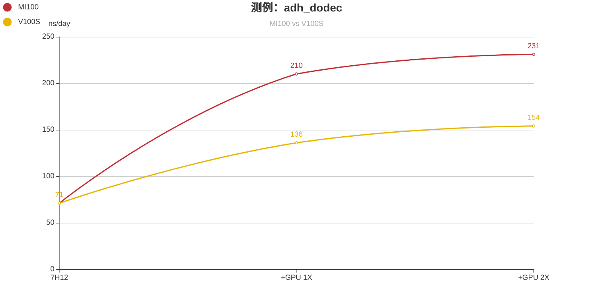

# [Gromacs](https://github.com/gromacs/gromacs) that can be accelerated at AMD GPUs like [MI100](https://www.amd.com/en/products/server-accelerators/instinct-mi100) by [ROCm](https://www.amd.com/en/graphics/servers-solutions-rocm)


## GPU acquirement

#### [AMD Instinct Accelerators](https://www.amd.com/en/graphics/servers-radeon-instinct-mi) : [MI100](https://www.amd.com/en/products/server-accelerators/instinct-mi100) / MI50 (especially fast)
#### other AMD GPU supporting [ROCm](https://www.amd.com/en/graphics/servers-solutions-rocm)

## System acquirement

#### Centos 8.3 / Ubuntu 18.04 with [ROCm](https://www.amd.com/en/graphics/servers-solutions-rocm) 4.2 installed (vertified)
#### other Linux system capable of equipping with [ROCm](https://www.amd.com/en/graphics/servers-solutions-rocm)

## installation guide
```
cd gromacs-amdgpu
cmake .. -DGMX_GPU_USE_AMD=on
make -j12 // or your own parallel counts
make check
make install
```

## estimate performance
```
MI100 = V100S 2X
MI100 = A100 1.3X
2*MI100 = MI100 1.2X
```


## external links
#### initial Gromacs repo
#### https://github.com/gromacs/gromacs

#### amd hipify docker image
#### https://www.amd.com/en/technologies/infinity-hub/gromacs

## No AMD GPU?
#### [testing at MI100 cloud machine ready to run Gromacs equipped with ROCm 4.2 and CentOS 8.3 costs even less than $1 for 1 hour, and it's also available to use for one single hour](https://www.ucloud.cn/site/active/uhost-mi100.html)
